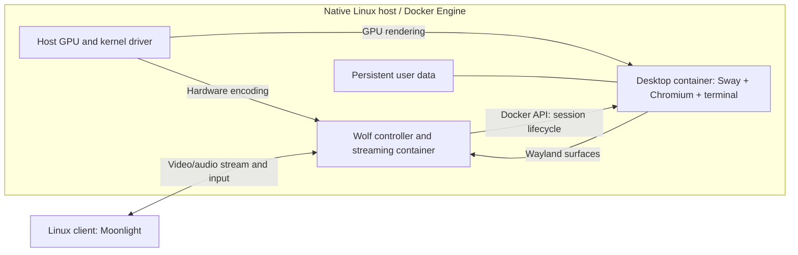

# docker-vm design

Status: NVIDIA reference profile implemented. An earlier Google Chrome desktop
bring-up completed on the reference NixOS host; the final Debian Chromium image
is built but its live validation is blocked because an external host NVIDIA/CDI
reconfiguration removed the CDI device specification. Performance and reconnect
benchmarks remain pending.

## Purpose and decision

Provide a responsive, remotely accessible Linux desktop running in Docker on a
native Linux host. The desktop must support multiple normal browser windows,
GPU rendering, hardware video encoding, audio, keyboard, and mouse.

Use **Docker Engine + Games on Whales Wolf + Sway + Chromium**, accessed with
**Moonlight on a Linux client**. Wolf manages streaming and launches a separate
desktop application container. This is a container desktop, despite the project
name: it shares the host kernel and is not a virtual machine.

This is an engineering choice based on the architecture, not a claim that we have
measured the fastest possible implementation. Success requires verifying every
stage on the actual host GPU and client.

## Scope

The first release serves one trusted user and one desktop session. It runs
headlessly without capturing the host desktop or requiring a physical monitor.
The browser executes inside the desktop container; Moonlight displays its output.
Viewing the desktop from a web browser is not required for the first release.

Required behavior:

- Open, resize, and switch between multiple Chromium windows and dialogs.
- Preserve browser profiles, downloads, and desktop settings across recreation.
- Support audio playback, normal typing, scrolling, and browser shortcuts.
- Preserve ordinary absolute mouse behavior: never warp, trap, confine, or hide
  the pointer as a side effect of streaming.
- Diagnose missing GPU acceleration rather than silently calling a software
  fallback a successful accelerated setup.
- Leave the host desktop usable independently.

Multi-user scheduling, Windows guests, gaming integrations, USB passthrough,
webcam forwarding, seamless clipboard/file transfer, and browser-only remote
access are deferred. Do not assume those features come with video streaming.

## Architecture



Wolf provides the virtual display and streaming infrastructure; Sway inside the
application container supplies window management. Follow the upstream nested
compositor arrangement rather than adding a second independent display capture
server. Use Sway with a floating-window-friendly configuration, a small launcher,
terminal, and file manager. Start Chromium automatically.

No Sunshine server is required alongside Wolf. They are alternative streaming
hosts for Moonlight, not successive stages in this pipeline.

Upstream documents Sway support and recommends selecting the same GPU for
rendering and encoding to enable its zero-copy paths. Buffer compatibility still
has to be verified; same-GPU selection alone does not prove zero-copy execution.
[Wolf configuration](https://games-on-whales.github.io/wolf/stable/user/configuration.html)

## Host and GPU contract

Target native Linux Docker Engine with Compose v2. The implemented reference host
is NixOS Linux x86_64 with NVIDIA CDI. The worker is a coherent pinned Debian 13
runtime that copies the pinned upstream GoW lifecycle/compositor scripts; it does
not share the host distribution and does not add a Docker Desktop VM layer.

A preflight command must report host/kernel, Docker context, GPU PCI identity,
driver, render-node mapping, container device permissions, and encoder support.
GPU selection must be explicit on systems with multiple adapters. A device named
`renderD128` is not sufficient identification across machines or reboots.

| GPU | Container integration | Streaming baseline | Required checks |
| --- | --- | --- | --- |
| Intel | DRM render node plus appropriate userspace drivers and group access | Hardware H.264 encoder supported by the pinned Wolf build | Actual render GPU, encode entry points, client decode |
| AMD | DRM render node plus Mesa and group access | Hardware H.264 encoder supported by the pinned Wolf build | Codec availability in installed Mesa packages, buffer import, encode |
| NVIDIA | Host driver plus validated driver-library injection for both controller and worker | NVENC H.264 | Driver/library compatibility, DRM modesetting, render and encode |

NVIDIA Container Toolkit is the standard Docker integration, but Wolf's current
quickstart warns that its Toolkit route is less stable than the documented manual
driver-volume route. Test the selected release before choosing the shipped NVIDIA
profile; retain the upstream manual route as a documented fallback. Do not install
a kernel GPU driver inside the image. Map only the selected GPU where supported.
[Docker GPU access](https://docs.docker.com/engine/containers/gpu/),
[Wolf quickstart](https://games-on-whales.github.io/wolf/stable/user/quickstart.html)

## Browser and desktop runtime

Run maintained open-source Chromium as a regular user, with
`--ozone-platform=wayland`, and retain the browser sandbox. The final worker
must use a non-Snap Chromium package; an earlier Google Chrome bring-up is not
the shipped browser implementation. Avoid `--no-sandbox`, `--disable-gpu`, and blanket
GPU-blocklist overrides as deployment defaults. The Docker default seccomp
profile blocked the earlier Chrome bring-up's namespace setup on the reference host; the worker uses
a narrow profile that permits `clone`, `unshare`, and `setns` while retaining
the other Docker restrictions. The earlier Chrome renderer inspection confirmed
`NoNewPrivs: 1` and two seccomp filters; repeat this proof for final Chromium.

Use a maintained browser package that works without a host Snap service. Pin the
desktop image for reproducibility and rebuild regularly for browser security
updates. Provide Firefox as a later diagnostic alternative if Chromium has a
driver-specific issue.

Give the worker a private 2 GiB `/dev/shm` allocation and validate it with the
upstream compositor stack. Compose settings on the Wolf controller do not
automatically configure workers: apply worker limits and mounts through Wolf's
Docker runner configuration. Host IPC, if actually required by the selected
release, must be recorded as an explicit implementation exception.

Check Chromium's `chrome://gpu` for the actual renderer, compositing, and WebGL.
Check `chrome://media-internals` separately for video decoding. Browser GPU
rendering, browser media decoding, server stream encoding, and client stream
decoding are four distinct checks. Hardware encoding does not prove the browser
renders on the GPU. Browser video decode may vary by codec and driver.

The desktop uses ordinary visible browser windows on a virtual display. It does
not use Chromium headless mode; no blanket claim about modern headless Chrome's
GPU support is needed for this design.
[Chromium Ozone](https://chromium.googlesource.com/chromium/src/+/main/docs/ozone_overview.md)

## Stream and responsiveness

Initial tuning values are test inputs, not measured guarantees:

| Setting | Initial value | Reason |
| --- | --- | --- |
| Resolution / refresh | 1920x1080 at 60 Hz | Establish a reproducible baseline |
| Codec | H.264 with hardware encoding and decoding | Broad compatibility |
| Bitrate | 20 Mbps on wired LAN | Starting quality/bandwidth tradeoff |
| Client | Native Moonlight, hardware decode verified | Direct streaming client |
| Network | Wired LAN; direct VPN path for off-site use | Limit jitter and relay delays |
| Scaling | Match stream resolution to client output where practical | Avoid unnecessary scaling |

After baseline validation, test 1440p60 and 1080p120. Test HEVC if both ends support
hardware processing. Defer AV1 until verified in the selected Wolf release and
both GPUs. Do not assume a newer codec minimizes latency.

Measure fine text and colored text as well as scrolling and video. Chroma
subsampling can soften text even at high bitrate. Record negotiated format;
do not promise 4:4:4 support without an actual end-to-end test. Avoid saturating
GPU rendering or CPU resources so compositor and streaming work can meet their
frame deadlines.

## State and session lifecycle

Keep three classes of data separate:

- Versioned configuration templates and image definitions in Git.
- Wolf pairing/configuration state in a persistent host directory.
- A persistent worker home containing browser data, settings, and downloads.

Use one profile directory per desktop identity. Never launch two Chromium
process trees against the same writable profile. Keep app identifiers stable
across upgrades so user data remains attached to the intended desktop.

Desired default: disconnecting the client leaves the desktop alive, and reconnect
reattaches to that session. Explicit stop gracefully ends the browser and desktop.
Host reboot restores saved data, not process memory.

Wolf pauses a session on disconnect and stops it on explicit cancellation.
`WOLF_STOP_CONTAINER_ON_EXIT` controls whether the stopped app container is
removed; it does not itself guarantee a live compositor survives reconnect.
Treat live reconnect, compositor survival, resource cleanup, and duplicate-session
prevention as implementation gates. If the pinned release cannot preserve a
complete live session, document that limitation and offer restart-with-profile
persistence; do not describe it as seamless resume.
[Wolf lifecycle and configuration](https://games-on-whales.github.io/wolf/stable/user/configuration.html)

Back up browser data while the browser is stopped, or use a consistent filesystem
snapshot. Back up pairing keys separately with restricted access. Image rollback
may not reverse browser profile migrations; retain a pre-upgrade data backup.

## Networking and trust boundaries

Wolf is a trusted host-management component: access to the Docker socket is
effectively host administration. Follow its documented device/input setup first,
then minimize permissions against functional tests. Its upstream quickstart
includes broad device mounts; do not portray that configuration as a hardened
multi-tenant sandbox.

The browser worker must not receive the Docker socket, Wolf administration socket,
host home directory, or host display socket. Expose only required GPU/input/audio
resources and its own persistent data. Prefer a normal bridged worker network;
the controller may use host networking for discovery and streaming.

Allow the selected release's documented streaming ports only from the LAN or VPN.
Keep pairing/administration restricted to those networks, and exclude credentials
and certificates from Git. Use WireGuard or Tailscale for off-site access; verify
a direct connection because a relay can materially affect responsiveness.

The desktop must use normal windowed absolute pointer behavior: it must not
grab, confine, or hide the host/client mouse merely because the stream is active.
Any input mode that changes this is a regression unless explicitly selected by
the trusted user.

## Proposed repository layout

The NVIDIA reference implementation includes the files below. Its Wolf, GoW
script source, and Debian runtime bases are digest-pinned; locally built wrapper
tags are intentionally used by Compose because the CUDA/GLVND additions are
host-profile-specific.

```text
compose.yaml                 # Wolf controller and persistent state
compose.nvidia.yaml          # Validated NVIDIA-specific integration
.env.example                 # GPU selection and state paths; no secrets
images/desktop/Dockerfile    # Pinned GoW base, Chromium and desktop tools
images/wolf/Dockerfile       # Pinned Wolf plus minimal NVRTC runtime wrapper
config/wolf/                 # Templates; runtime pairing state lives elsewhere
config/sway/                 # Floating-friendly desktop and shortcuts
scripts/preflight           # Read-only dependency/GPU diagnostics
scripts/configure           # Generate local config without overwriting state
scripts/doctor              # Renderer, encoder and session diagnostics
docs/SETUP.md               # Install, pair, start, reconnect and stop
docs/BENCHMARKS.md          # Hardware, versions, measurements and limitations
```

Pin controller and base images by digest after the first successful integration.
Store exact versions in benchmark results. Configuration generation must preserve
runtime pairing state and refuse accidental profile-directory reuse.

### Reference-host implementation notes

The tested host is NixOS x86_64 with an NVIDIA RTX 3060 and driver 595.71.05.
It uses Docker CDI device `nvidia.com/gpu=0`, not the Docker `--gpus` path and
not a copied host driver volume. This profile is NVIDIA-specific: its GBM,
GLVND, and NVRTC settings must not be described as validated Intel or AMD
support.

The CDI mount supplies the NVIDIA driver libraries and GBM backend. The wrapper
also installs the minimal Ubuntu Plucky runtime package
`libnvrtc12=12.2.140~12.2.2-2build1`, whose package dependency supplies
`libnvrtc-builtins12.2`, and provides the unversioned NVRTC loader aliases
required by Wolf's GStreamer CUDA plugin. NVIDIA GLVND and external-platform
JSON is installed in the images because the CDI-mounted NixOS JSON contains
host-only store paths; the images select their valid `/usr/share` manifests.

Observed bring-up evidence: Wolf selected `nvcodec` for H.264 and H.265 and
reported its NVIDIA zero-copy pipeline. A CDI smoke pipeline using
`cudaupload ! cudaconvertscale ! nvh264enc` completed. The earlier browser
bring-up exposed a 1920x1080 Wayland Sway output and a visible floating browser
window using the selected `/dev/dri/renderD128`; it must be repeated with the
shipped Chromium worker. These observations do not
measure throughput, latency, browser video decode, or prove end-to-end
zero-copy; those remain acceptance work.

## Implementation and acceptance gates

1. **Bring-up:** identify available hardware; validate Wolf's test stream through
   Moonlight; prove hardware encoding and client decoding before adding Chromium.
2. **Desktop:** launch the worker, verify its real GPU renderer, open three browser
   windows, test dialogs, scrolling, WebGL, audio, shortcuts, and downloads.
3. **Persistence:** disconnect/reconnect, explicit stop/start, container recreation,
   and host reboot; verify the promised state at each boundary.
4. **Performance:** run a 10-minute 1080p60 wired-LAN workload covering text editing,
   rapid scrolling, video, and WebGL. Record encode/decode time, network latency,
   jitter, frame drops, CPU/GPU load, codec, bitrate, and image versions.
5. **Packaging:** publish setup and recovery instructions only after they work on
   the reference machine. Add other GPU families as separately tested profiles.

Baseline performance targets: sustained 60 fps during continuous motion, under
1% dropped frames, and p95 encode and decode times each below one 16.7 ms frame
budget where instrumentation provides distributions. Aim for measured LAN
input-to-photon latency below 50 ms using an external measurement method. These
are acceptance targets, not results. Moonlight statistics alone do not measure
complete input-to-photon latency; do not invent percentiles from averages.

If software rendering or encoding appears, report the exact fallback and fail
the accelerated acceptance gate. Ordinary static pages need not produce 60 unique
frames per second.

No hardware purchase is prescribed until the existing host and client are known.
All GPU families remain unvalidated until tested. CI can validate configuration,
build images, and check startup logic; GPU performance requires real hardware.

## Alternatives and reconsideration points

If Wolf's desktop session lifecycle cannot meet the requirement, evaluate a
dedicated compositor plus Sunshine/Moonlight. Sunshine's official Docker image
is currently described as experimental and not a complete standalone desktop,
so that alternative includes extra integration work.
[Sunshine Docker](https://docs.lizardbyte.dev/projects/sunshine/latest/md_DOCKER__README.html)

If access from a web browser becomes required, evaluate Selkies with hardware
encoding and WebRTC. It is a different delivery option to benchmark, not an
additional streaming layer in front of Wolf.
[Selkies setup](https://docs.selkies.io/start)

For local access on the same host, a container connected directly to the host
Wayland display avoids network video encoding, but does not fulfill this project's
independent remote-desktop delivery requirement.

## Current state

Architecture documented; no desktop service deployed, image built, or GPU benchmark
performed. The next deliverable is a runnable Compose/controller configuration and
desktop image validated against the actual Linux host and Moonlight client.
